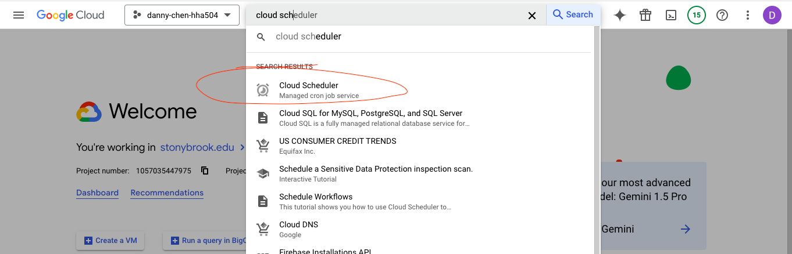

# Assignment: Exploring Serverless Computing and Cron Jobs in Azure, GCP, and GitHub

# Instructions
* Screenshots of the serverless function deployment process in both Azure and GCP.
* The code and configuration of your GitHub Action workflow.
* Screenshots or documentation of the GCP Cloud Scheduler setup.
* A brief reflection on the use cases, benefits, and limitations of serverless functions.

## Screenshots of Serverless Function Deployments
### Azure
1. Click "Function App," then "Create" or "Create Function App"

2. Choose "Consumption" for the hosting option

3. Ensured the following configurations were used in these tabs
    * Basics
        * Subscription: Azure for Students
        * Resource Group: HHA-504
        * Runtime stack: Python
        * Version: 3.11
        * Region: East US
        * Operating System: Linux

    * Monitoring
        * Enable Application Insights: No

    * Deployment
        * Basic authentication: Enable

4. Click "Review + create," then click "Create"
5. Once deployment is successful, go to the resource
6. In "Overview," scroll down and click "Create Function" below the "Create in Azure portal" header

7. In the new panel that opens, click "HTTP trigger"

8. Make a function name, click "Next," and then "Create"

9. Alter the code to do a desired function
    * The image below just uses the default function given
10. Click "Save," then "Test/Run"
11. Add name(s) and value(s) below "Name" and "Value" header OR enter them in JSON format below "Body" header (choose 1 method), then click "Run" to see if function ran successfully

### GCP
1. Click "Cloud Run functions," then "Create Function"

2. Ensured the following configurations were used in these tabs:
    * Basics
        * Trigger type: HTTPS
        * Authentication: Allow unauthenticated invocations

    * Runtime
        * Autoscaling --> Maxinum number of instances: 3

    * Left everything else as default
3. Go to next page, taking you to the "Code" section
4. Set runtime to Python 3.10
5. Alter the code to do desired function
    * The image below shows a function that checks if systolic pressure is in normal range
6. Click "Test Function"
7. Change key names as needed in JSON, then click "Run Test" to see if function ran successfully

8. Click "Deploy"

### Running Function Outside of Azure and GCP 
9. Copy URL
    * In Azure, click "Get function URL" and copy the link under "default (Function key)"
10. In your editor...
    * store the URL into some kind of variable
    * store test keys and values in a dictionary
11. Running the function outside of Azure and GCP may look something like the images below, but will depend on what the function is.
    * Azure 

    * GCP

### Screenshots and Documentation of Cloud Scheduler Setup
1. Click "Cloud Scheduler" 

2. Enable API if needed 

3. Create a job

4. The following configurations were used 
    * NOTES
        * [Crontab.guru](https://crontab.guru/) can help in writing the cron schedule expressions for "frequency"
        * The cloud function URL will differ between functions
        * After finishing each section's configuration, either click "Continue" or the next header below it

    * NOTE: To find your timezone
        1. Type and select your country
        2. Type the time zone
        3. Scroll to find your state's specific time zone
    * Example:

5. Click "Create"
6. To test if the scheduler works, you can either...
    * click "Force Run"
    * wait for the duration set in Cloud Scheduler to elapse (1 minute in this example)

## GitHub
### Code and Configuration for the Cron Job
* The cron job's code for sending an email and making a joke is in [send_email.py](https://github.com/dnce17/HHA504_assignment_functions/blob/main/send_email.py) and [make_joke.py](https://github.com/dnce17/HHA504_assignment_functions/blob/main/make_joke.py), respectively. Their configurations are in the [.github/workflows](https://github.com/dnce17/HHA504_assignment_functions/tree/main/.github/workflows) folder

## Brief Reflection on Serverless Functions
**Question**:
Reflect on the use cases for serverless functions in cloud environments. Consider the benefits and limitations of using Functions as a Service (FaaS) in both Azure and GCP.

**Answer**:
Some use cases of serverless functions are scheduling tasks and creating trigger events. Scheduling tasks might include sending notifications or updating data at a certain time daily. Trigger events can include when users upload something or enter a website. 

One benefit of using FaaS in both Azure and GCP is that users only pay for when the functions run, removing the need to predict how much capacity is needed in advance and risk overpaying for capacity that may not be used. Another benefit is that users do not have to worry about managing the server; they can focus solely on the code rather than the infrastructure. 

One limitation of FaaS is that debugging may be more difficult since the server is managed by the vendor. Security may also be a concern for FaaS; while users are responsible for securely configuring their functions, they also rely on the vendor to ensure that the underlying infrastructure is secure.
